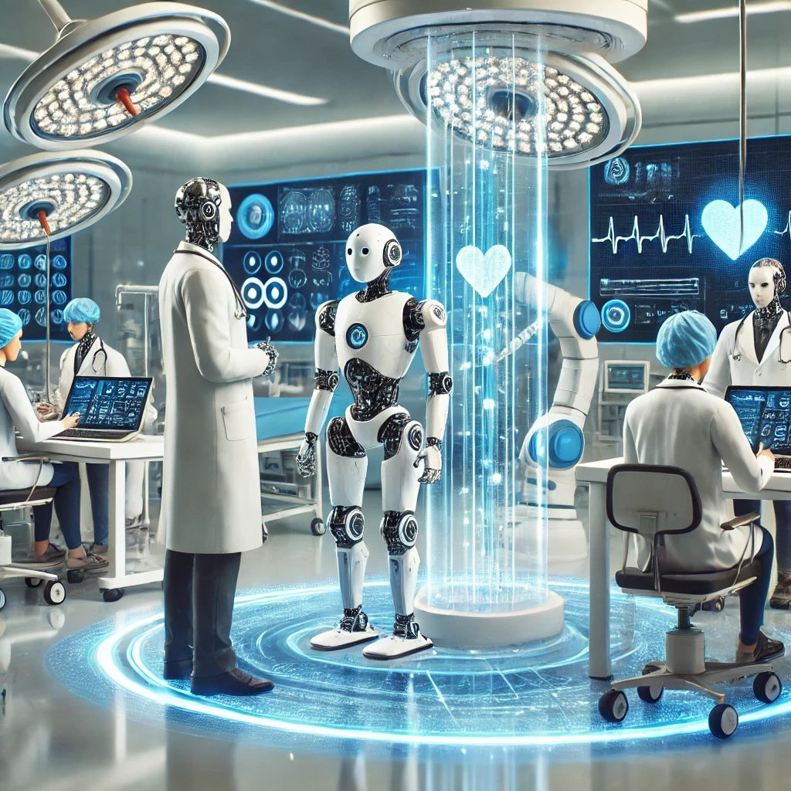

## Introduction

L’intelligence artificielle est un sujet très actuel, mais son histoire remonte à 1956. Toutefois, ce n’est que ces dernières années qu’elle a réellement pris son essor, grâce aux progrès technologiques et à son intégration dans de nombreux domaines. Aujourd’hui, elle est de plus en plus utilisée au quotidien et constitue un véritable soutien pour l’homme dans des secteurs variés.

Les modèles de langage de grande taille (LLM) sont une branche de l’intelligence artificielle basée sur l’apprentissage profond. Ils sont entraînés à partir d’énormes quantités de textes et fonctionnent en prédisant le mot suivant d’une phrase en fonction du contexte. Cette méthode leur permet de produire des textes fluides et cohérents, proches de ceux rédigés par un humain. Grâce à ces capacités, ils sont utilisés dans de nombreux domaines comme la génération de contenu, la traduction ou encore l’assistance à la rédaction. Parmi ces modèles, ChatGPT est sans doute l’un des plus connus et populaires.

Aujourd’hui, l’intelligence artificielle est présente partout, et le domaine médical ne fait pas exception, bien au contraire. Son intégration apporte de véritables avancées, améliorant aussi bien les diagnostics que les traitements. Cependant, cette évolution s’accompagne de défis importants. L’utilisation de l’IA en médecine soulève des questions éthiques, notamment sur la protection des données des patients et la gestion des responsabilités en cas d’erreur.
En effet, selon une étude, le marché mondial de l'IA générative dans le secteur des soins était estimé à 0,8 milliard de dollars en 2022 et devrait atteindre 17,2 milliards de dollars d'ici 2032. [@medecins_quels_2024]

Ce rapport vise à explorer les principales applications de l’IA en médecine, ainsi que les opportunités et les limites qu’elle présente. Nous analyserons d’abord les avancées technologiques dans le domaine médical, avant de discuter des défis et des perspectives d’évolution de ces innovations.

## Les principales applications de l’IA en médecine

Nous connaissons les intelligences artificielles mais jusqu'ou peuvent-elles aller dans un domaine aussi important que la medecine? 
Les avancées technologiques ont permis à l’IA d’atteindre un niveau de performance parfois supérieur à celui des experts médicaux dans certaines tâches, comme le diagnostic, la médecine personnalisée, le suivi des patients ou encore la conception de nouveaux traitements. Grâce à ces outils, les professionnels de santé peuvent affiner leurs diagnostics et adapter les soins en fonction des besoins spécifiques de chaque patient, favorisant ainsi une prise en charge plus précise et efficace.

### L'impact de l'IA à travers divers secteurs

Avec le temps, différentes intelligences artificielles ont été développées pour répondre à de nombreux problèmes [@inserm_intelligence_2024]: 

- PulseLifeAI est conçu pour aider à la prise de décision médicale en fournissant des réponses instantanées et précises sur les symptômes, les diagnostics et les traitements, en s’appuyant sur des recommandations médicales officielles.

- La strat UP SUOG qui a développé un programme d’assistance échographique fournissant au praticien des informations pertinentes en temps réel pendant l’examen, l’aidant à identifier les caractéristiques inhabituelles et lui suggérant les images à réaliser pour affiner le diagnostic en cas de pathologie suspectée.

- Paige, pour diagnostiquer certains cancers, comme celui du sein et de la prostate, et identifier avec précision les cellules cancéreuses.

### La robotique 

Il faut également parler de la robotique qui est en pleine expansion et constitue une véritable évolution grâce à ses différentes intelligences artificielles:

- La chirurgie assité par un ordinateur, qui remplace le chirurgien, "garantissant" une opération d'une précision exceptionnelle. Il est également possible d'opérer à distance, ce qui est tout de même assez incroyable.

- Il y a également les prothèses intelligentes Qui visent à réparer ou à augmenter le corps humain. Par exemple, pour les personnes ayant des problèmes cardiaques, il existe des stimulateurs cardiaques, ou encore pour celles ayant perdu un membre, comme un bras, des prothèses artificielles.

- De plus, il existe des robots d'assitance aux personnes qu'elles soient agées ou fragiles. Ce principe vise à imiter le vivant et à interagir avec les humains. Cependant, cela soulève des questions éthiques concernant la frontière entre le robot et l’humain, ainsi que la protection de la vie privée et des données personnelles. L'exemple le plus connu est le phoque PARO, une peluche-robot émotionnelle d’assistance thérapeutique, destinée principalement à aider les personnes atteintes de la maladie d'Alzheimer et de troubles apparentés. [@inno_med_paro_2015].

## Les enjeux et défis de l’IA en médecine

On entend souvent dire que des métiers comme ceux de médecin, chirurgien ou radiologue pourraient disparaître avec le temps, car, grâce ou à cause de l’IA, leur rôle serait moins sollicité. Cependant, il est essentiel de rappeler que l’IA repose sur des données référencées et qu’elle a du mal à s’adapter à de nouvelles situations qu’elle n’a jamais rencontrées.

Prenons l’exemple de la radiologie. La formation de l’algorithme nécessite un grand nombre d'images pour lui apprendre à identifier les signes de pathologies. À chaque image, il est indiqué si elle présente ou non des signes pathologiques. À la fin de son apprentissage, l’algorithme est capable de reconnaître de manière très précise les anomalies sur de nouvelles images. Selon Marie-Christine Jaulent, directrice de recherche à l'Inserm et spécialiste de l’informatique médicale, bien que ce métier ne disparaisse probablement pas, il est appelé à évoluer. En effet, contrairement aux radiologues, l’IA peut offrir un regard plus précis et reproductible, mais elle ne pourra pas remplacer l’adaptabilité et le jugement humain face à des cas complexes ou inattendus.

### Les avantages pour le secteur de la médecine

Il est indéniable que les IA apportent une aide précieuse aux professionnels de santé en leur fournissant rapidement des données fiables, comme l’analyse d'images médicales (IRM, radiographies, scanners), souvent avec une précision supérieure à celle des médecins. Par exemple, l’outil DeepMind Health [@l_google_2018] a prouvé son efficacité dans la détection précoce de certaines pathologies, contribuant ainsi à réduire les erreurs de diagnostic.

### Limites et risques de l’IA en médecine

Il est important de souligner les enjeux liés à la fiabilité et aux biais des algorithmes. Les modèles d’IA sont formés sur des bases de données médicales, et si ces biais ne sont pas corrigés, l'IA pourrait produire des diagnostics erronés ou mal adaptés à certaines populations (exemple des differentes couleurs de peaux).
Il est aussi crucial de considérer la dépendance technologique et la perte de compétences. L’utilisation fréquente des IA dans les diagnostics et décisions médicales pourrait réduire les compétences humaines si les professionnels de santé se fient trop aux recommandations de l’IA sans les remettre en question.

### La réglementation pour les IA

Pour profiter pleinement des avancées technologiques, un défi majeur réside dans la confidentialité et la protection des données. L’IA repose en effet sur l'exploitation de grandes quantités de données médicales, ce qui soulève des questions cruciales concernant la confidentialité et le respect du RGPD (Règlement Général sur la Protection des Données). À l’avenir, il sera donc essentiel de veiller à une gestion rigoureuse des données utilisées pour alimenter les serveurs, afin d’éviter des risques liés à leur utilisation massive. [@inserm_intelligence_2024].

De plus, en cas d’erreur, une question fondamentale se pose : qui est responsable ? Qui doit rendre des comptes si un algorithme d’IA fournit un diagnostic erroné ou une recommandation de traitement inappropriée ? Il s’agit là d’une question juridique complexe, encore en débat entre les médecins et les concepteurs des outils d’IA.

## Conclusion et perspectives

L'intelligence artificielle constitue une avancée net dans le secteur médical, proposant des solutions novatrices pour améliorer les diagnostics, les traitements et augmenter l'efficacité du suivi des patients. Avec les algorithmes de l'apprentissage automatique, les personnels de santé ont accès à des outils capables d'examiner de grands volumes de données en un temps limité ce qui rend ainsi une prise en charge plus rapide et adaptée.

A l'avenir, il est indeniable de faire marche arrière et d'enlever cet outil à l'homme qui ne peut etre que benefique et d'une grande avancée pour la médecine mais il faudrait que le développement d’algorithmes soit plus transparents et explicables pour garantir la confidentialité et la protection des données. Une formation adaptée sur les IA pour les professionnels de santé garantirait une utilisation optimale et sécurisée de ces technologies.
Il est crucial de trouver un équilibre entre ces innovation et les précautions éthiques pour garantir que ces technologies bénéficient à tous sans compromettre la qualité des soins ni la confiance des patients et des professionnels de santé.

## Bibliographie
